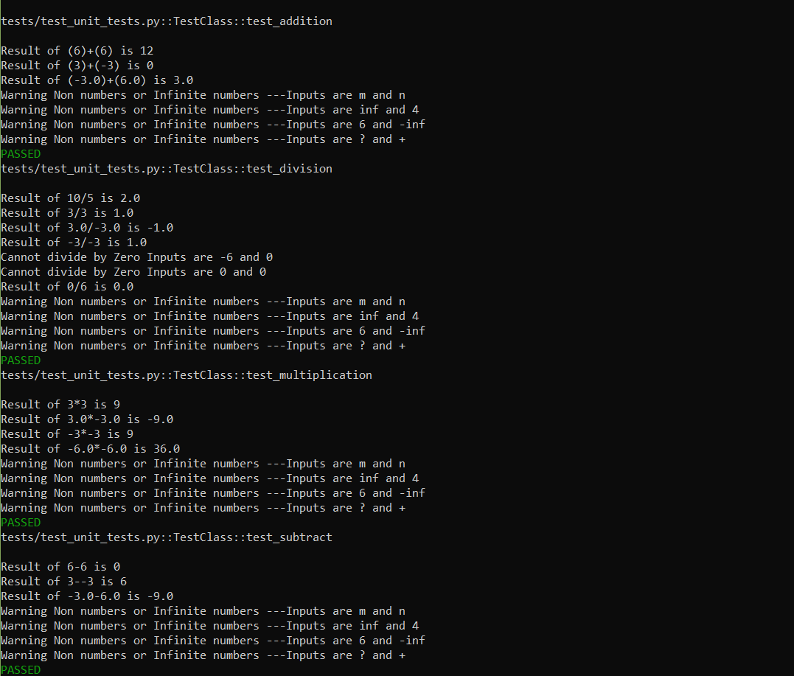
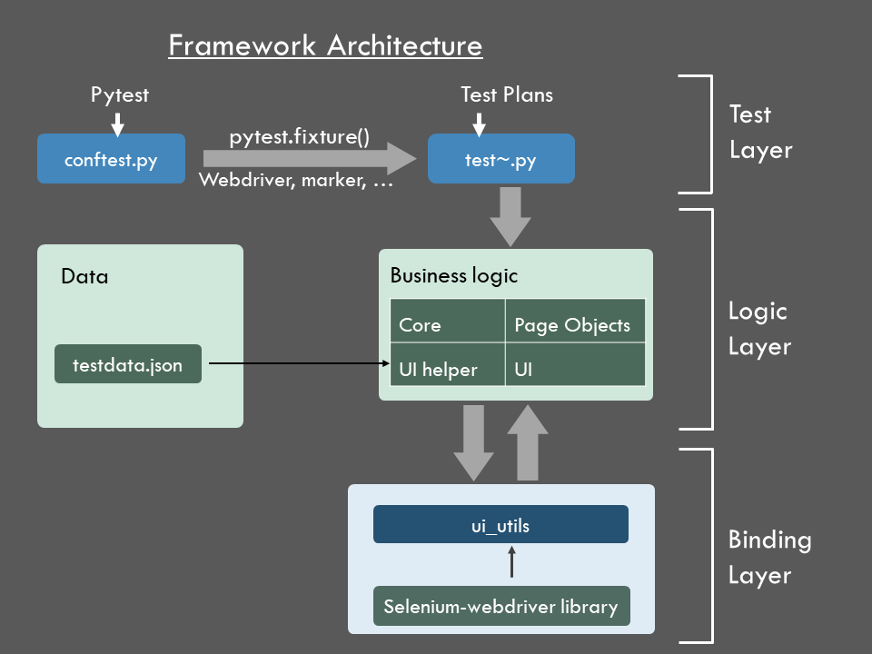
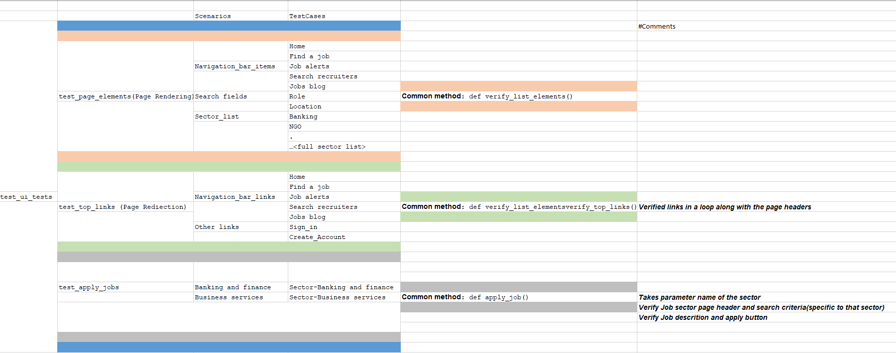
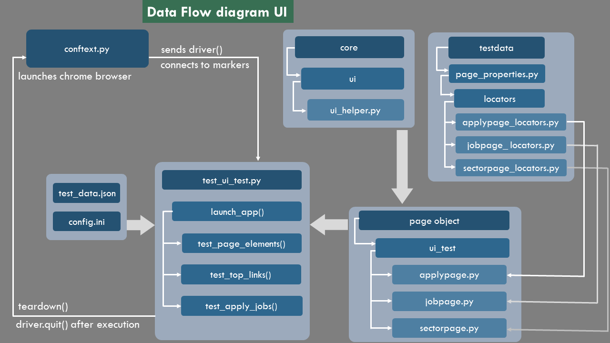

# QA Assignment submitted by **Saurabh Piyush**
This repo contains the UI as well as API automation cases that were developed as part of the assignment, to qualify for the post of QE III at Economist

## Index
1. [Framework](#Framework)
2. [Run the Automation Suite](#Run-the-Automation-Suite)
    1. [Method A Windows](#Method-A-Windows)
    2. [Method B Mac](#Method-B-Mac)
3. [CI CD Support](#CI-CD-Support) 
4. [Framework Architecture](#Framework-Architecture)
5. [UI Test Plans](#UI-Test-Plans)
6. [Data Flow UI](#Data-Flow-UI)
7. [Why this framework?](#Why-this-framework?)
8. [Contact](#Contact)

## **Framework**
For this assignment, I used pytest framework - a python-based test automation framework suite. It is a Test Driven Development (TDD) framework comprising of the following packages:
- **pytest** (for executing test plans in TDD format)
- **unittest** (for executing unit tests)  
- **requests library** (to automate API)
- **selenium-webdriver** (to automate UI and saving failed scenarios screenshots)
- **pytest-html** (for reporting)
- **logging module** (for logging - tracking events that occur while software runs)

### **Run the Automation Suite**
First you need to clone the repo to your local

- Clone with HTTPS:     
    `git clone https://github.com/saurabhpiyush1187/qaeco_cicd.git`

Then you need to follow either of the below two methods
#### **Method A**: Windows
**Requirements** 
--python 3.7 and above

Open the command line and point it to the directory of the repo on your system. Switch to the virtual environment by executing "set_up.bat"
    
    C:\~\qaassigment> set_up.bat
That's it.
It will switch to virtual environment and install necessary modules. After executing above batch file, the user will enter the virtual environment. Execute another file to run all the api and ui cases

    (venv)C:\~\qaassigment> run_ui.bat
This will start the execution of all the test cases (UI)

Execute the following cases to run the Unittest cases:

    (venv)C:\~\qaassigment> run_unittest.bat

If you do not want to switch to virtual environment,use the following command to install requirements

    pip install -r requirements.txt

Unittest cases are stored in ./tests/test_unit_tests.py. Results can be viewed in the console

Unit tests are created to handle
- ####positive numbers
- ####negative numbers
- ####decimals
- ####divide by zero
- ####infinite numers

Since the **unittest** and **ui automation** tasks were given separately, that is why I have not grouped them together in execution. However, it will be just as easy to group and execute them together.

**View HTML Report**
The automation framework is created with the support of **pytest-html**.To view results after execution. Open

>.reports/report.html

**Troubleshooting**

I have included the chromedriver.exe in the project. However, chrome cases may fail due to chromedriver installation issues or binaries not set.If the chrome fails to launch, you can set the binaries to the installed chrome on your machine:

Edit file: ./tests/conftest.py

Sample code:
        
        
        def setup(browser):
        global driver
        capabilities = {'browserName': 'chrome',
        "chromeOptions": {
          'binary': "C:\Program Files\Google\Chrome\Application\chrome.exe"
                        }
                        }
        
        if browser=='chrome':
            if platform == "win32":
                driver=webdriver.Chrome(executable_path="."+os.sep +"browsers"+os.sep +"chromedriver.exe",desired_capabilities=capabilities)
                print("Launching chrome browser in Windows.........")
            elif platform =="darwin":
                driver=webdriver.Chrome(executable_path="."+os.sep +"browsers"+os.sep +"chromedriver")
                print("Launching chrome driver in Mac")
        return driver

In the above snippet , binary is set to chrome path installed in my system, you can change it you yours.

#### **Method B**: Mac

Requirements
–python 3.7 and above

Since virtual environments cannot be shared accross Operating systems, I have freezed the requirements to 

>./requirements.txt

Please follow the steps below:

1. **Open the terminal and point it to the directory of the repo on your system**
    
2. **Execute the following commands**

            python3 -m venv env
            source venv/bin/activate
            pip3 install -r requirements.txt
            
            or 
            
            python3 -m venv env
            source env/bin/activate
            pip3 install -r requirements.txt

    This will install all the dependent libraries

3. **Run the script**

    Now, simply run the command

    python -m pytest -s -v -m "ui" --html=./reports/report.html --browser chrome

         or

    py -m pytest -s -v -m "ui" --html=./reports/report.html --browser chrome

 For Unit test cases
    
    py -m pytest -s -v -m "unittest" --html=./reports/report.html

4. **Troubleshooting in Mac**
    
    If you have any issue with chromedriver, you can copy **./Browsers/chromedriver** to **/usr/local/bin**

    
## **CI CD Support**

I have used github Actions to support CI/CD. The job will automatically run cases in case of any push into main branch.
Please see runs here

    https://github.com/saurabhpiyush1187/qaeco_cicd/actions

To test cross-operating systems , I have created 2 workflows for windows and linux

## **Framework Architecture**

## **UI Test Plans**

## **Data Flow UI**

## **Why this framework?**
- ### **Open Source and Compatible**
    Pytest is open source and compatible with other test frameworks like BDD. Moreover,it can be used by development teams, test teams, teams that are practicing Test Driven Development(TDD), as well as in open-source projects. Finally,It also support Fixtures & Classes, which makes it easier to create common test objects available throughout a module/session/function/class.The framework architecture avoids and encourages non-hardcoded services as it parameterizes as much as possible.
  
- ### **Auto-Discovery of Tests**
    Pytest's default finds tests with the file name with the preface, "test," or the suffix "_test.py." However, we can configure Pytest to discover custom names by changing the Pytest configuration file “pytest.ini.” By adding the following extension, Pytest automatically discovers tests with the filename “verify.”
  
            [pytest]  
            python_files = verify_*.py 
            python_classes = Verify 
            python_functions = *_verify 
  

- ### **Command line execution**
    Pytest provides several options to run tests from the command line.

            pytest -v -s #verbosity and execution time of test
            e.g:pytest –v –s  

            pytest <file_name>   #run tests in module/file  
             e.g:pytest test_demo.py
            
            pytest –k <name>  #run all the test with matching name 
             e.g:pytest –k add #runs all the test with add  
            
            pytest filename::testName #runs only one test 
             e.g:pytest test_demo::test_addition 

- ### **Supports reporting**
    The Pytest community has a rich test of plug-ins to extend the module's functionality. One of them is pytest-html that generates a HTML report for test results.  

- ### **Integrated API automation**
    The framework also supports python requests which is simple, yet elegant HTTP library. There is no need for any third party application to test and automate APIs.The accelerated execution speed of automated API tests leads to more effective resource consumption and lower overall testing costs.

- ### **Support for CI/CD**
    Pytest supports generating reports in JUnit format. By creating the XML file CI/CD systems like Jenkins can read the log files.
    
        pytest --junitxml=path 
    

## **Contact**
Let me know if you would like to know more about the architecture or have any feedback. I would like to talk more about the framework suite and architecture in detail.

With best regards,

Saurabh
