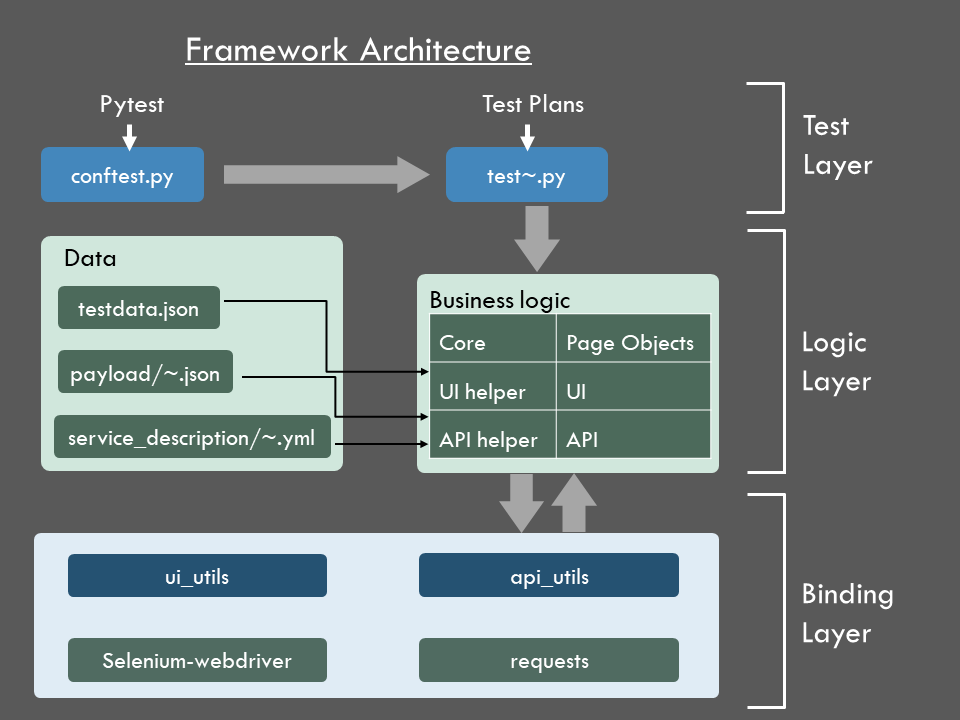

# QA Assignment submitted by **Saurabh Piyush**
This repo contains the UI as well as API automation cases that were developed as part of the assignment, to qualify for the post of Senior Automation Engineer at Sennder

## Index
1. [Framework](#Framework)
2. [Run the Automation Suite](#Run-the-Automation-Suite)
    1. [Method A Windows](#Method-A-Windows)
    2. [Method B Mac](#Method-B-Mac)
3. [API Automation](#---API-Automation)
4. [Framework Architecture](#Framework-Architecture)
5. [Why this framework?](#Why-this-framework?)
6. [Contact](#Contact)

## **Framework**
For this assignment, I used pytest framework - a python-based test automation framework suite. It is a Test Driven Development (TDD) framework comprising of the following packages:
- **pytest** (for executing test plans in TDD format)
- **requests module** (to automate API)
- **selenium-webdriver** (to automate UI and saving failed scenarios screenshots)
- **pytest--html** (for reporting)
- **logging module** (for loggging - tracking events that occur while software runs)

### **Run the Automation Suite**
First you need to clone the repo to your local

- Clone with HTTPS:     
    `git clone https://github.com/saurabhpiyush1187/qaassigment.git`

Then you need to follow either of the below two methods
#### **Method A**: Windows
**Requirements** 
--python 3.7 and above

Open the command line and point it to the directory of the repo on your system. Switch to the virtual environment by executing "set_up.bat"
    
    C:\~\qaassigment> set_up.bat
That's it.
It will switch to virtual environment and install necessary modules. After executing above batch file, the user will enter the virtual environment. Execute another file to run all the api and ui cases

    (venv)C:\~\qaassigment> run.bat
This will start the execution of all the test cases

**View HTML Report**
The automation framework is created with the support of **pytest--html**.To view results after execution. Open

>Reports/report.html
    

#### **Method B**: Mac

Requirements
–python 3.7 and above

Since virtual environments cannot be shared accross Operating systems, I have freezed the requirements to 

>./requirements.txt

Please follow the steps below:

1. **Open the command line and point it to the directory of the repo on your system**
    
2. **Execute the following commands**

            python -m venv env
            source env/bin/activate
            pip install -r requirements.txt
            

    This will install all the dependent libraries

3. **Run the script**

    Now, simply run the command
    
    python -m pytest -s -v -m "smoke" --html=./Reports/report.html --browser chrome

4. **Troubleshooting in Mac**
    
    If you have any issue with chromedriver, you can copy **./Browsers/chromedriver** to **/usr/local/bin**
    and edit the following code in **./testCases/conftest.py**

    Change this:
    
            elif platform =="darwin":
            driver=webdriver.Chrome(executable_path="."+os.sep +"Browsers"+os.sep +"chromedriver")   
            
    To this:
    
            elif platform =="darwin":
            driver=webdriver.Chrome()
    

## **API Automation**
I have also automate the cases through cases through api

If you want to run only API cases, simply run the command(Mac) or edit the same in **run.bat**(Windows):
    
    python -m pytest -s -v -m "api" --html=./Reports/report.html

If you want to run only UI cases, run the command:

    python -m pytest -s -v -m "ui" --html=./Reports/report.html --browser chrome

## **Framework Architecture**

## **Why this framework?**
- ### **Bridging the gap between Product Owner and QA**
    With the test plan is written plain english in BDD format, it acts as a layer between the acceptance criteria and the automation code. The test plans are easy to understand and written almost in the way the Product Owner writes writes the user stories. 

- ### **Bridging the gap between Manual QA and automation code**
    When a user story comes to test, the first step is that we create test plans then test the functionality and then move to automation once it is stable enough to automate. Usually, QA ends up creating two test plans, one for manual QA execution and other for automation. 

    Using cucumber-js, the framework provides a way to attach your code directly to the manual test plan and thus avoiding creating another plan for automation 

- ### **Reducing Selenium's complexity**
    UI automation's primary requirement is identifying the web element. Based on the selector you use (Xpath, css, class, id etc.), there is a separate command for each type of selector. By using MangoJS, you don't need to keep track of the selector you use. 
    
    The `get_element` command, for example, takes the selector as the first parameter. It identifies whether the selector is a XPath or a css selector and fetches the element. Under-the-hood, MangoJS uses Selenium to fetch the element. It just makes it easier for the QA engineer to focus on the business logic and not worry about which syntax to use

- ### **Integrated API automation**
    The framework seggregates web-service data from the code and provides a convinient way to link them both. The framework architecture avoids and encourages non-hardcoded services as it parameterizes as much as possible.

- ### **Dockerized**
    For running regression cases as fast as possible, and to achieve the target of spontaneous releases, moving the script to docker container helps achieve all of it

- ### **Choosing this over cypress**
    I have worked with `cypress` in the past. It is great if the motive is to automate only end-to-end cases (in testing terminology, this is also referred to as the happy-path testing).
    
    But, if you want to automate a wide set of integration cases, using cypress turns out to be a bit complex and less coder-friendly. For instance, cypress doesn't support conditional `if-else` statements. 

    For complex functionalities, we ofetn move beyond the end-to-end cases and have to create a larger automation plan to cover integration cases as well

## **Contact**
Let me know if you would like to know more about the architecture or have any feedback. I would like to talk more about the framework suite and architecture in detail.

With best regards,

Saurabh
